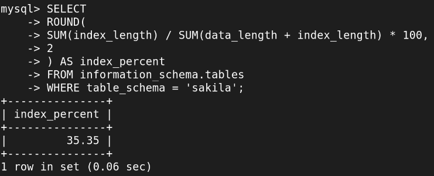
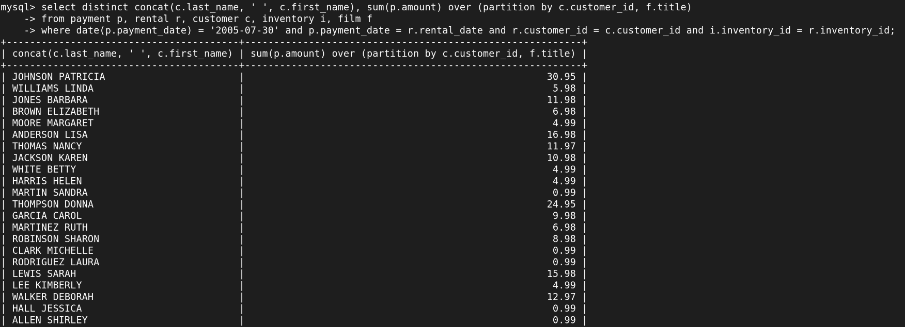

# Домашнее задание к занятию 5 "`SQL. Часть 2`" - `Заяц Алексей`

### Инструкция по выполнению домашнего задания

   1. Сделайте `fork` данного репозитория к себе в Github и переименуйте его по названию или номеру занятия, например, https://github.com/имя-вашего-репозитория/git-hw или  https://github.com/имя-вашего-репозитория/7-1-ansible-hw).
   2. Выполните клонирование данного репозитория к себе на ПК с помощью команды `git clone`.
   3. Выполните домашнее задание и заполните у себя локально этот файл README.md:
      - впишите вверху название занятия и вашу фамилию и имя
      - в каждом задании добавьте решение в требуемом виде (текст/код/скриншоты/ссылка)
      - для корректного добавления скриншотов воспользуйтесь [инструкцией "Как вставить скриншот в шаблон с решением](https://github.com/netology-code/sys-pattern-homework/blob/main/screen-instruction.md)
      - при оформлении используйте возможности языка разметки md (коротко об этом можно посмотреть в [инструкции  по MarkDown](https://github.com/netology-code/sys-pattern-homework/blob/main/md-instruction.md))
   4. После завершения работы над домашним заданием сделайте коммит (`git commit -m "comment"`) и отправьте его на Github (`git push origin`);
   5. Для проверки домашнего задания преподавателем в личном кабинете прикрепите и отправьте ссылку на решение в виде md-файла в вашем Github.
   6. Любые вопросы по выполнению заданий спрашивайте в чате учебной группы и/или в разделе “Вопросы по заданию” в личном кабинете.
   
Желаем успехов в выполнении домашнего задания!

---

### Задание 1

Напишите запрос к учебной базе данных, который вернёт процентное отношение общего размера всех индексов к общему размеру всех таблиц.

### Решение:



---
### Задание 2

Выполните explain analyze следующего запроса:
```sql
select distinct concat(c.last_name, ' ', c.first_name), sum(p.amount) over (partition by c.customer_id, f.title)
from payment p, rental r, customer c, inventory i, film f
where date(p.payment_date) = '2005-07-30' and p.payment_date = r.rental_date and r.customer_id = c.customer_id and i.inventory_id = r.inventory_id
```
- перечислите узкие места;
- оптимизируйте запрос: внесите корректировки по использованию операторов, при необходимости добавьте индексы.

### Решение:



1. Вместо DISTINCT и оконной функции SUM(p.amount) OVER (PARTITION BY c.customer_id, f.title) целесообразно использовать агрегацию через GROUP BY.

2. Использовать JOIN с явным указанием условия соединения в ON.

3. Избегать применения функции DATE(), чтобы не ломать возможные индексы.

4. Для повышения производительности можно добавить индекс INDEX(payment_date) в таблице payment.

5. Если CONCAT не является обязательным, лучше возвращать last_name и first_name отдельными полями, а объединение выполнять на уровне приложения.